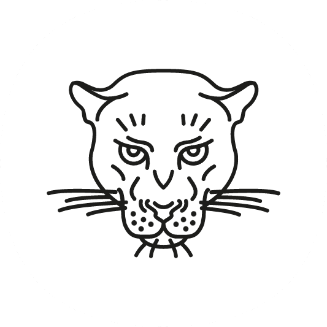

# OpenClassRooms Project 4

## Description
---

SEO Optimisation for a web design Agency "La panthère"

15 SEO and accessibility mistakes have been fixed for this project.

## Technologies and tools used
---

## 🌐 Last online version
---

[GitHub Page](https://ixouu.github.io/ixouu-Chanon_Julien_4_SEO_062022/)

## Contact
---
You can email me [here](contact@julien-chanon.fr)